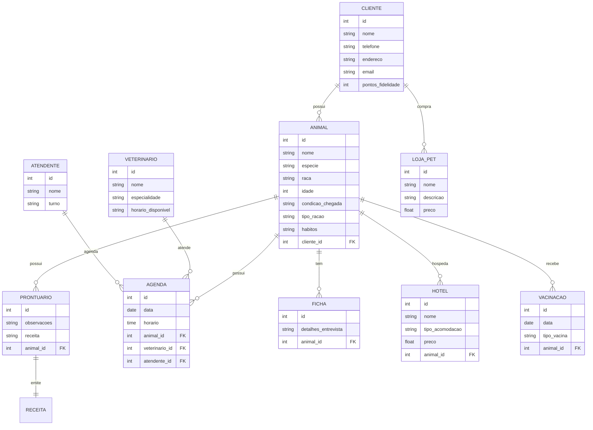
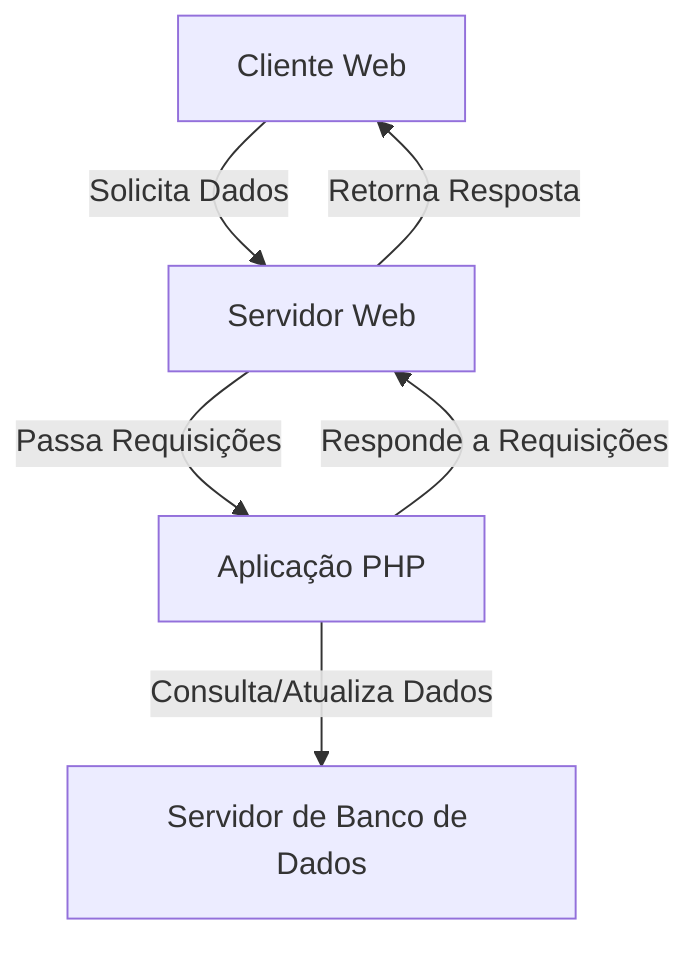

# Cassio_Bernardo
Projeto engenharia software marcelandia
---
# 1. Descrição do Sistema
Sistema para Clínica veterinária

Autor: Cassio Bernardo

Amigo Pet
1.Uma clínica veterinária atende apenas os animais: gatos e cachorros. 
2.Os clientes devem fazer um cadastro de si e dos animais. 
3.Os clientes devem informar as condições nas quais os animais chegam. 
4.Os clientes devem informar o tipo de ração que o animal come. 
5.O cliente deve informar hábitos do animal. 
6.Para cada animal é possível que mais de um veterinário o atenda. 
7.Os animais podem chegar e serem atendidos de acordo com uma agenda do dia. 
8.Cada animal atendido receberá uma ficha e um prontuário. 
9.Outros donos podem querer marcar horários de atendimento futuro. 
10.O atendimento gera uma receita para o animal. 
11.Quando um cliente chega na clínica veterinária ele é atendido por um atendente. 
12.O atendente deve verificar se existe agenda disponível com um veterinário. 
13.O atendente deve colocar o cliente e seu animal na fila de espera, se for o caso. 
14.O atendente deve levar o cliente e o animal até o veterinário. 
14.O veterinário deve realizar uma entrevista com o dono do animal. 
15.O resultado da entrevista deve ir para um formulário. 
16.O veterinário deverá examinar o animal e anotar em prontuário(ficha) suas observações. 
17.Dependendo da situação do animal este receberá uma receita.
18.A clinica funcionara das 8:00 as 19:00 h.
19.A clinica tem plantões depois das 19:00h
20.A clinica havera programas de fidelidade para clientes.
21.Temos uma loja para Petz.
22.Programa de pontos para Clientes.
23.Atendimento a domicilio.
24.A clinica tem um hotel para cães.
25.A clinica atende por agendamentos.
26.A clinica faz a vacinação periodicas dos animais.

---
# 2. Diagrama do banco de dados

---
# 3. Diagrama de casos de uso

---
# 4. Principais telas do sistema

---
# 5. Arquitetura do sistema

